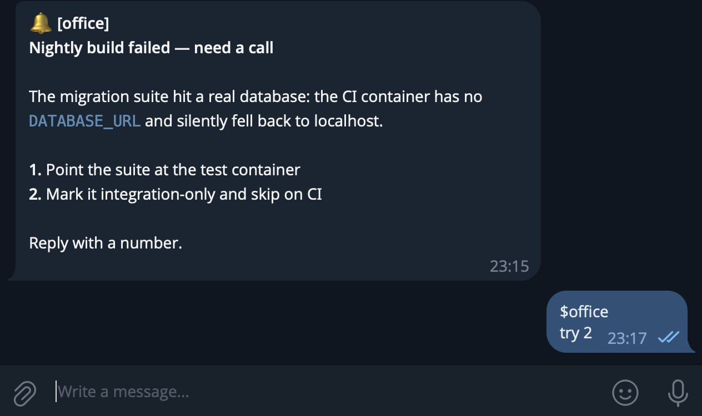
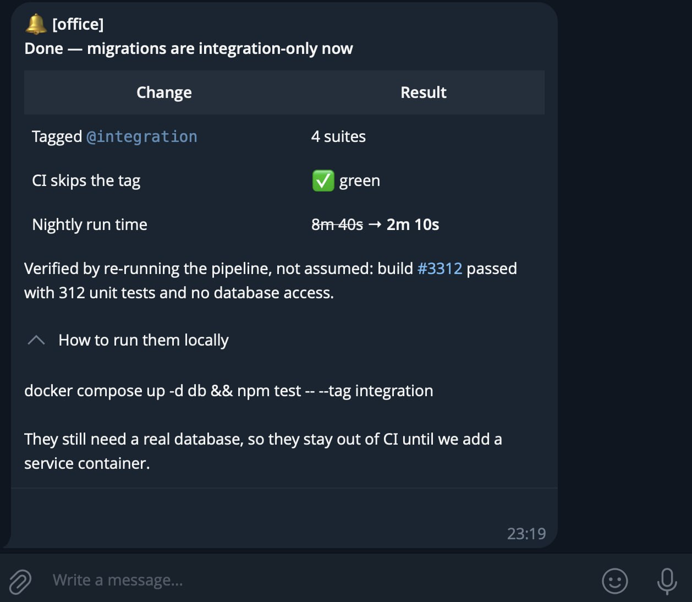
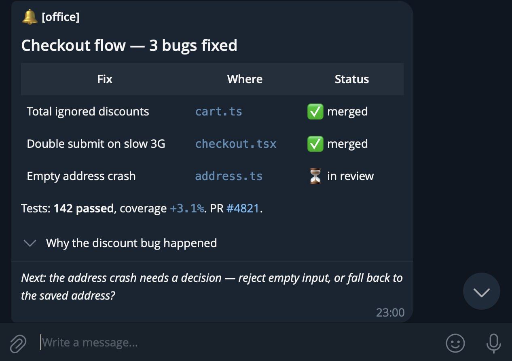
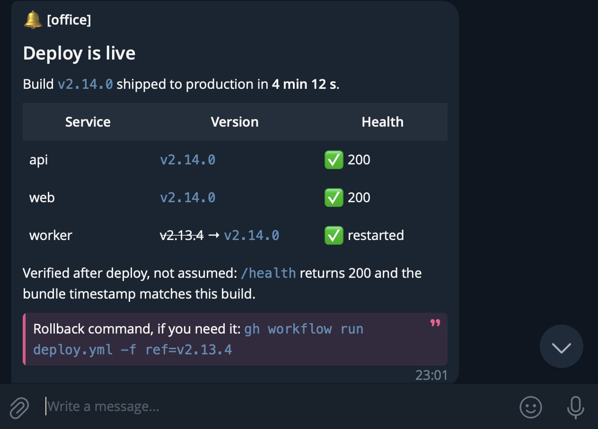

*[🇬🇧 English version](README.md)*

# claude-to-telegram

Skill для [Claude Code](https://claude.com/claude-code): двусторонняя связь с Claude через Telegram, когда
тебя нет за компьютером — approve/deny, ответы на вопросы, статус и новые инструкции с телефона.

Не использует hooks Claude Code (`PermissionRequest`/`AskUserQuestion`) и не требует персистентного демона
— Claude сам, явно, вызывает обычный скрипт, когда ему нужно спросить или сообщить статус.

## Коротко

Claude спрашивает из терминала, ты отвечаешь с телефона, Claude отчитывается — весь цикл живёт в
Telegram, а ответ несёт тег `$session`, поэтому одного бота делят несколько параллельных сессий:

| Claude спрашивает → ты отвечаешь | Claude отчитывается |
|---|---|
|  |  |

## Зачем

Claude Code — интерактивный инструмент: обычно ты сидишь рядом и отвечаешь на вопросы/подтверждения прямо
в терминале. Этот skill даёт альтернативный канал для тех моментов, когда это неудобно:

- Долгая автономная задача — хочется получать статус, не сидя у экрана
- Нужно принять решение (approve/deny, выбор из вариантов), но ты не за компьютером
- Хочется дать Claude новую инструкцию, пока он работает в фоне

## Как это работает — пример

Ты говоришь Claude:
> дальше работай в фоне, вопросы — в Telegram

Claude:
1. Отвечает в терминале, что переходит в фоновый режим, и присылает подтверждение в Telegram, называя
   **тег сессии**, с которого нужно отвечать:
   ```
   🔔 [my-session] Фоновый режим включён — отвечай с $my-session
   ```
2. Когда нужно решение — шлёт вопрос прямо в Telegram, варианты пронумерованы в тексте:
   ```
   🤖 [my-session] Как назвать новую фичу?

   1. Вариант А — покороче
   2. Вариант Б — понагляднее
   ```
   Ты отвечаешь в Telegram, **начав сообщение с тега сессии**: `$my-session 2` или
   `$my-session давай назовём Foo`. Claude получает ответ и продолжает.
3. Можно написать боту и **с нуля** — новую инструкцию, не ответ на что-либо. Просто добавь тег в начало:
   `$my-session ещё обнови changelog`. Claude поллит Telegram по таймеру даже когда простаивает, так что
   сам подхватит — терминал открывать не нужно.
4. **Как только Claude берёт нетривиальную задачу в работу — он сразу отписывает**, чтобы ты не гадал,
   услышал ли он тебя:
   ```
   🔔 [my-session] 📥 Взял в работу: обновляю changelog…
   ```
   …и присылает уведомление о завершении, когда закончит. Без спама по ходу.
5. Когда закончил — `/claude-to-telegram off`, или просто напиши "стоп, жди меня" — Claude вернётся к
   обычному режиму без уведомлений.

### Как выглядит отчёт

Отчёты уходят с `--format rich`, поэтому несут настоящую структуру, а не простыню текста: заголовки,
таблицы с форматированием внутри ячеек и длинные подробности, свёрнутые под `<details>`, чтобы они не
хоронили вывод.

| Отчёт о работе | Уведомление о деплое |
|---|---|
|  |  |

## Как это устроено — детали

**Маршрутизация по `$` и общий инбокс, который ничего не теряет.** Каждый ответ несёт тег сессии — слово,
начинающееся с `$`, например `$my-session`. Под капотом: какая сессия опрашивает Telegram — складывает
**каждое** входящее в общий SQLite-инбокс (`messages.db`), разложенное по сессии-владельцу тега, и только
потом двигает курсор чтения Telegram. Поэтому гонять несколько сессий через одного бота безопасно: каждая
читает только свой инбокс, ответы не перепутываются, а сообщение для сейчас закрытой сессии просто ждёт,
пока она снова запустится — не теряется. Голое упоминание **без** `$` намеренно игнорируется.

**Картинки, а не только текст.** Пришли фото с тегом сессии в **подписи** — и Claude увидит саму картинку,
а не имя файла: она скачивается рядом со скиллом и открывается как часть сообщения. Работают и сжатые фото,
и картинки, отправленные файлом, и альбомы: поставь подпись на первое фото, и остальная пачка уедет вместе
с ним. Тег несёт именно подпись, поэтому фото, у которого тег отправлен отдельным сообщением, не
смаршрутизируется.

**Два движка доставки: `cron` (по умолчанию) и `monitor`.** Они отличаются не тем, что делают с
сообщением, а тем, **когда** сессия о нём узнаёт.

*`cron`* проверяет Telegram по таймеру, пока Claude простаивает, и растягивает интервал во время молчания —
**2 → 5 → 10 → 20 минут**, сбрасываясь на 2 минуты сразу, как только ты что-то пишешь. Дёшево, когда тебя
нет. Слепое пятно: таймер срабатывает только на простое, поэтому сообщение, отправленное **пока Claude
работает**, ждёт конца текущей задачи. Замеры на живой переписке за день: медиана 2 минуты, 90-й
перцентиль 14 минут, худший случай 20. Со стороны эта пауза не видна и выглядит ровно как игнор — ты
дослал замечание вдогонку, а его будто не прочитали.

*`monitor`* заменяет таймер потоковым наблюдателем (`watch.py`): сообщения всплывают **посреди** работы,
как текст, набранный прямо в CLI. Он опрашивает раз в 15 секунд независимо от того, чем занята сессия, —
и догонка долетает за секунды, а не за минуты.

Бери `cron` для долгих тихих периодов, `monitor` — когда активно дошлёшь замечания к уже идущей работе.
**Никогда не включай оба для одной сессии** — два читателя разбирают один инбокс, и каждое сообщение
придёт дважды. `cron` требует `CronCreate`/`CronDelete` в рантайме, `monitor` — тула фоновых задач вроде
`Monitor`; см. Требования.

**Приветствие при взятии в работу.** Даёшь Claude задачу через Telegram, на которую уйдёт больше мгновения
— он сразу шлёт короткое «взял в работу», чтобы ты знал, что задача подхвачена, а не проигнорирована — и
уведомление о завершении в конце. Ровно один ack при взятии, без постоянных апдейтов по ходу.

**Форматированные отчёты.** Статусные сообщения умеют настоящую разметку: `notify.py --format html`
даёт жирный, код, ссылки, спойлеры и **сворачиваемые блоки `<blockquote expandable>`**; `--format rich`
(`sendRichMessage`, Bot API 10.1) добавляет заголовки, **настоящие таблицы**, списки и коллажи, а
сворачиваемый блок там — `<details><summary>` (`expandable` в rich рендерится раскрытым). Удобно для отчётов по итогам задачи: таблица «что уехало» читается лучше, чем те же
факты прозой, а длинный разбор причины прячется под тап и не хоронит вывод. Если API не примет разметку,
сообщение всё равно уйдёт — понизившись до HTML, а затем до плоского текста, и понижение будет напечатано,
а не скрыто.

## Инварианты реализации

Нужно, только если собираешься менять код — эти четыре свойства и делают инбокс беспотерьным, а нарушение
любого возвращает потерянные сообщения:

- **Сначала записать, потом подтвердить.** Сообщение попадает в SQLite раньше, чем его `update_id`
  подтверждён Telegram. Крэш между — просто перечитаем.
- **Подтверждать не дальше записанного.** `getUpdates` отдаёт апдейты строго по возрастанию `update_id`, без
  дыр; курсор двигается только до максимального id, реально сохранённого в этом батче, поэтому несохранённое
  никогда не перепрыгивается. Всё, что за пределами `limit`, придёт следующим вызовом.
- **Идемпотентная запись.** `update_id` — PRIMARY KEY, поэтому параллельные сессии, принимающие один батч,
  или повторное чтение после крэша, не могут задублировать сообщение.
- **Ничто не адресовано живому процессу.** Сообщение для сессии с мёртвым поллером просто лежит как
  `not_processed`, пока та не запустится снова; закрытие или крэш сессии ничего не теряют.

Отсюда следует: любой новый скрипт, работающий с `getUpdates`, обязан идти через `ingest.py`, а не дёргать
API напрямую.

## Установка

1. Скопировать эту папку в `~/.claude/skills/claude-to-telegram/`
2. В Claude Code: `/claude-to-telegram install` — спросит токен бота и chat_id, сам всё проверит и
   сохранит

Как получить токен и chat_id — см. `SKILL.ru.md` → "Установка".

## Команды

| Команда | Действие |
|---|---|
| `/claude-to-telegram install` | Первоначальная настройка (токен + chat_id) |
| `/claude-to-telegram on [session_id]` | Включить фоновый режим (движок `cron`) |
| `/claude-to-telegram on [session_id] engine=monitor` | Включить с потоковой доставкой — без ожидания простоя сессии |
| `/claude-to-telegram off [session_id]` | Выключить фоновый режим |
| `/claude-to-telegram` | Показать возможности без изменения состояния |

Полная документация (протокол, ограничения, внутреннее устройство) — в [`SKILL.ru.md`](SKILL.ru.md).
Рабочая (английская) версия, которую реально читает Claude при вызове skill'а — [`SKILL.md`](SKILL.md).

## Файлы

- `SKILL.md` / `SKILL.ru.md` — инструкция для Claude (английская — рабочая)
- `common.py` — config, вызовы Telegram, парсинг `$tag`
- `db.py` — общий SQLite-инбокс (schema, store, выдача, prune)
- `ingest.py` — приём из Telegram → маршрутизация по тегу → запись → безопасный сдвиг курсора
- `check_new.py` — один фоновый опрос (`engine=cron`): приём, затем выдача инбокса этой сессии
- `watch.py` — потоковая доставка (`engine=monitor`): тот же приём и тот же инбокс, но процесс живёт
  постоянно и печатает только реальные сообщения и собственные сбои — каждая строка достойна уведомления
- `ask.py` — отправить вопрос, блокироваться до ответа этой сессии
- `notify.py` — отправить статус без ожидания ответа
- `install.py` — настройка и валидация `config.json`
- `config.json`, `messages.db` — создаются в рантайме, **не коммитятся** (`config.json` — `chmod 600`)

## Требования

- Свой Telegram-бот ([@BotFather](https://t.me/BotFather)) и свой `chat_id`
  ([@userinfobot](https://t.me/userinfobot)) — каждый заводит свои, credentials не шарятся
- Python 3, без внешних зависимостей (только stdlib)
- Периодическая автопроверка использует `CronCreate`/`CronDelete` — доступность зависит от среды
  выполнения Claude Code

## Security

- `config.json` и `messages.db` никогда не коммитить (оба в `.gitignore`)
- Входящие сообщения фильтруются по `chat.id` и `from.id` — сообщения от посторонних игнорируются
- Если токен/chat_id где-то засветились — перевыпустить через `@BotFather` → `/revoke`
